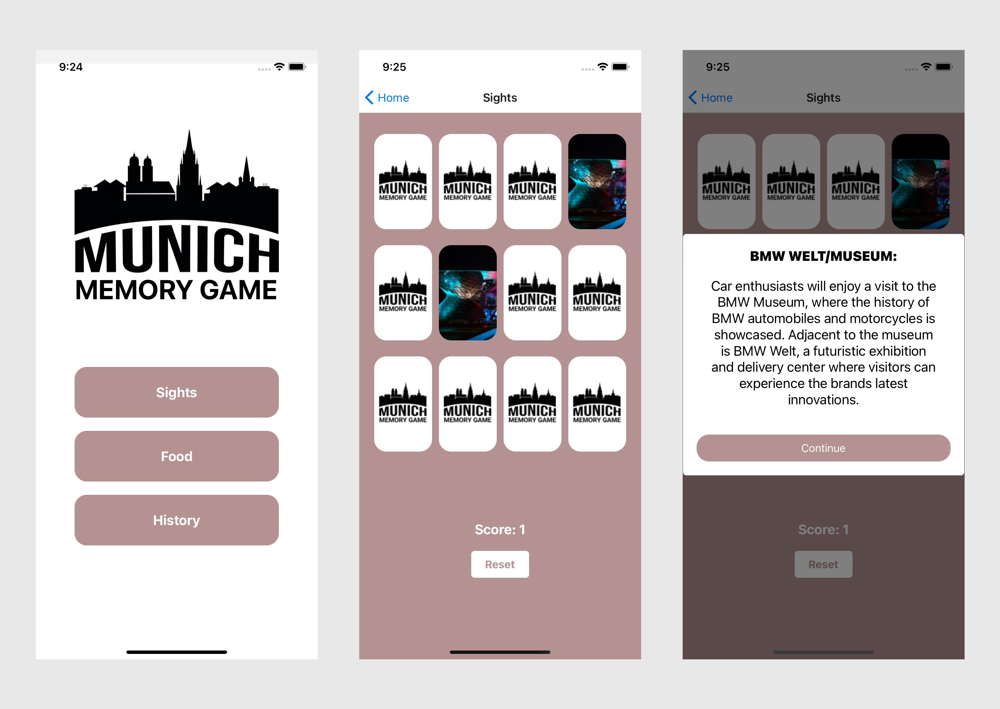

<p align="center">
  <h1 align="center">Munich Memory Game</h1>
</p>


## Features

- Munichs most popular sights
- Munichs most popular food
- Munichs most popular historical events

<p align="center">
  
</p>

## 📦 Getting started

Installing Dependencies:

```bash
$ npm install
```

Running the app:

```bash
$ npx expo start
```

You can also open the project on Android Studio and XCode.
